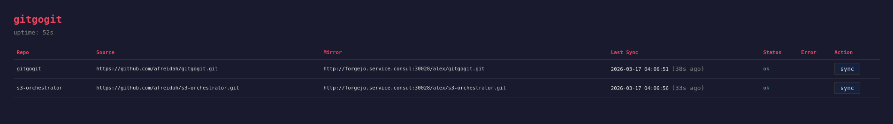

# gitgogit



A lightweight Git repository mirroring daemon. It watches one or more source repositories and pushes every change to one or more mirror remotes.

## Build & install

Requires Go 1.24 or later. The only external dependency is `gopkg.in/yaml.v3`.

**User install** — builds and places the binary in `$(go env GOPATH)/bin` (typically `~/go/bin`). No `sudo` required; just ensure `~/go/bin` is on your `$PATH`.

```sh
make install
# equivalent: go install .
```

**System-wide install** — copies the binary to `/usr/local/bin` so every user on the machine can run it.

```sh
sudo make system-install
# or with a custom prefix:
sudo make system-install PREFIX=/opt/homebrew
```

**Build only** — produces a `./gitgogit` binary in the current directory without installing it.

```sh
make build
# equivalent: go build -o gitgogit .
```

**Uninstall** (system-wide install only):

```sh
sudo make system-uninstall
```

**Other make targets:**

```sh
make help          # show all available targets
make test          # run tests
make vet           # run go vet
make lint          # run golangci-lint
make govulncheck   # scan for known vulnerabilities
```

## Docker

```sh
make docker-build                         # build image
CONFIG=config.yaml make docker-run        # run with mounted config
```

The container runs the daemon in the foreground using `--daemon-child`. Set `log_file: /dev/stdout` in the config for container-friendly logging.

For SSH auth, mount your key into the container:

```sh
-v ~/.ssh/id_ed25519:/home/gitgogit/.ssh/id_ed25519:ro
```

## Config file

Default location: `~/.config/gitgogit/config.yaml`

```yaml
repos:
  - name: myrepo
    source:
      url: git@github.com:you/myrepo.git
      auth:
        type: ssh
        key: ~/.ssh/id_ed25519
    mirrors:
      - url: git@codeberg.org:you/myrepo.git
        push_strategy: branches+tags   # safe for hosting platforms
        auth:
          type: ssh
          key: ~/.ssh/id_ed25519
      - url: https://gitlab.com/you/myrepo.git
        auth:
          type: token
          env: GITLAB_TOKEN   # name of the env var holding the token

daemon:
  interval: 60s          # how often to poll (default: 60s)
  retry_attempts: 3      # retries per mirror on failure (default: 3)
  retry_backoff: 10s     # base backoff; doubles each attempt (default: 10s)
  log_level: info        # debug | info | warn | error (default: info)
  log_file: ""           # path to JSON log file (default: ~/.local/share/gitgogit/gitgogit.log)
  web:
    enabled: false       # enable web dashboard (default: false)
    listen: ":8080"      # listen address (default: :8080)
```

### Auth types

| Type    | Required field | Notes |
|---------|---------------|-------|
| `ssh`   | `key`         | Path to private key; `~` is expanded. Sets `GIT_SSH_COMMAND`. |
| `token` | `env`         | Name of an env var containing the HTTPS token. Injected as `oauth2:TOKEN@` in the URL. |
| *(none)*| —             | Leave `auth:` out entirely for public repos. |

### Push strategies

Per-mirror `push_strategy` controls how refs are pushed to the target:

| Strategy        | Behavior |
|----------------|----------|
| `mirror`       | Default. `git push --mirror` — pushes all refs. Use for bare backup targets. |
| `branches+tags`| `git push --all` + `git push --tags` — skips platform-internal refs like `refs/pull/*`. Use when mirroring to hosting platforms (Forgejo, Gitea, GitLab). |

## CLI reference

```
gitgogit <command> [flags]
```

### `start`

Start the daemon in the background.

```sh
gitgogit start [--config PATH]
```

The daemon daemonizes via re-exec (`Setsid`). The PID is written to `~/.local/share/gitgogit/gitgogit.pid`. Log output (JSON) goes to `~/.local/share/gitgogit/gitgogit.log` unless `log_file` is set in the config.

### `stop`

Send `SIGTERM` to the running daemon.

```sh
gitgogit stop
```

The daemon finishes any in-flight syncs before exiting (30s timeout).

### `status`

Print the daemon's PID and start time.

```sh
gitgogit status
```

### `sync`

Perform a one-shot sync and exit. Useful for cron jobs or manual testing.

```sh
gitgogit sync [--config PATH] [--repo NAME] [--interval DURATION] [--log-level LEVEL]
```

`--repo` limits the sync to a single repo by name.

### `list`

Print a table of configured repos and their mirror URLs.

```sh
gitgogit list [--config PATH]
```

### `add`

Interactively add a repo to the config file.

```sh
gitgogit add [--config PATH]
```

Prompts for the repo name, source URL, source auth, and one or more mirror URLs with their auth. Writes the updated config back to disk.

## Web dashboard

Enable with `web.enabled: true` in the daemon config. Provides:

- Status overview of all repos and mirrors (last sync time, success/error)
- Manual sync trigger per repo
- Recent error log
- `/healthz` endpoint for container orchestrators (returns 200/503 JSON)

The dashboard auto-refreshes every 30s (3s while a sync is in progress).

## Daemon lifecycle

```
gitgogit start          # forks child, prints PID, returns immediately
gitgogit status         # shows running PID and start time
gitgogit stop           # sends SIGTERM; daemon drains in-flight syncs then exits
```

On startup the daemon performs an immediate sync of all repos, then repeats on every `interval` tick.

## Hot-reload

While the daemon is running, editing the config file triggers an automatic reload within `5s`. The next sync cycle uses the updated repo list and settings. No restart is required.

## Example workflow

```sh
# 1. Create a config
gitgogit add

# 2. Test it
gitgogit sync --repo myrepo

# 3. List what's configured
gitgogit list

# 4. Start the daemon
gitgogit start

# 5. Check it's alive
gitgogit status

# 6. Edit the config to add a new mirror; daemon reloads automatically within 5s

# 7. Stop when done
gitgogit stop
```

## Author
Evan Hutchinson (ev-the-dev)
